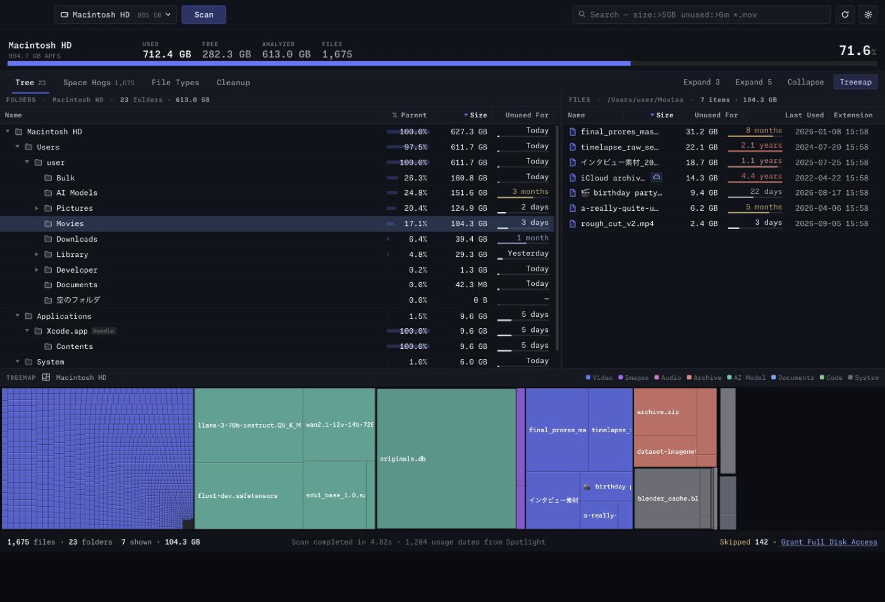

# DiskLens

macOS 向けディスク使用量アナライザー



[**ダウンロード**](https://github.com/ndhardt/DiskLens/releases/latest)

## 動作環境

| | |
|---|---|
| OS | macOS 14 以降 |
| アーキテクチャ | Apple Silicon (arm64) |
| フルディスクアクセス | 任意。無い場合は読めないフォルダをスキップして件数を表示 |

## 表示モード

タブで切り替えます。

| タブ | 内容 |
|---|---|
| Tree | 階層別。各階層で容量の大きい順。右に選択フォルダのファイル一覧 |
| 容量ランキング | 階層を無視した全体順位 |
| ファイル種別 | 拡張子別の集計 |
| クリーンアップ | 削除候補をグループ化して提示 |

Treemap はタブとは別に下部へ常時表示（非表示切り替え可）。容量を面積で表し、
表と選択が相互に同期します。左右の分割と Treemap との境界はドラッグでリサイズ。

### 列

| 表 | 列 |
|---|---|
| Tree | 名前 / 親フォルダ比 / サイズ / 実使用量 / ファイル / フォルダ / 最終使用 / 未使用期間 |
| ファイル一覧 | 名前 / サイズ / 実使用量 / 未使用期間 / 最終使用 / 変更日 / 作成日 / 拡張子 / パス |
| 容量ランキング | # / 名前 / サイズ / ディスク比 / 未使用期間 / 最終使用 / パス / 種類 / 優先度 |
| ファイル種別 | 拡張子 / カテゴリ / ファイル / 合計サイズ / 実使用量 / ドライブ比 / 平均サイズ / 最大ファイル |
| クリーンアップ | 項目 / 種別 / エントリ / ファイル / サイズ（右に選択グループの内訳） |

列見出しクリックで並べ替え。ペイン幅に応じて優先度の低い列から非表示（名前・サイズ・未使用期間は常時表示）。

### 容量ランキングの並べ替え・絞り込み

並べ替え: 容量が大きい順 / 長期間未使用順 / 大容量かつ未使用 / 最近使った順 / 最近変更した順

絞り込み: すべて / 1 GB 超 / 5 GB 超 / 10 GB 超 / 3か月以上未使用 / 6か月以上未使用 / 1年以上未使用 / 2年以上未使用

### カテゴリ

Video / Images / Audio / Archive / AI Model / Documents / Code / System / Other

カテゴリ名は日本語 UI でも英語表記。

## クリーンアップ

削除候補を 2 種類に分けて提示します。**再生成される**ものだけが既定で選択され、
**要確認**（ユーザー自身のファイル）が自動選択されることはありません。

| 種別 | 項目 | 対象 |
|---|---|---|
| 再生成される | Xcode のビルドデータ | `DerivedData` / `iOS DeviceSupport` / `CoreSimulator/Caches` |
| 再生成される | パッケージマネージャのキャッシュ | `.npm/_cacache` `.cache` `.gradle/caches` `.cargo/registry/cache` `.pnpm-store` `Caches/{Homebrew,pip,Yarn,go-build,ms-playwright}` |
| 再生成される | アプリのキャッシュ | `~/Library/Caches` の直下 |
| 再生成される | ログ | `~/Library/Logs` の直下 |
| 要確認 | 大容量かつ長期間未使用 | 5 GB 以上、1年以上未使用 |
| 要確認 | 古いダウンロード | `~/Downloads`、6か月以上未使用 |
| 要確認 | インストーラ | `.dmg` `.pkg` `.xip` `.iso`、3か月以上未使用 |

- 1 項目は 1 グループにしか属さない（合計が二重計上されない）
- パス接頭辞と `IS_SYSTEM` フラグの両方でシステム領域を除外
- 最終使用日時が不明なファイルは「長期間未使用」に含めない
- 1 グループあたり最大 4,000 件
- 実行すると通常の削除確認ダイアログを経由し、完了後に自動で再スキャン

## 最終使用日時

| 取得元 | 条件 |
|---|---|
| Spotlight `kMDItemLastUsedDate` | 既定。スキャン後、サイズ上位 30,000 件に対して取得 |
| ファイルシステムのアクセス日時 | Spotlight に記録が無い場合 |
| 不明 | どちらも取得できない場合 |

取得元はツールチップに表示。未使用期間はセル内に彩度を落としたバーで表示（7日未満 / 30日未満 / 3か月未満 / 6か月未満 / 1年未満 / 2年未満 / 2年以上）。

優先度（0–100）:

```
log2(サイズMB + 1) × log2(未使用日数 + 2)
```

サイズ上位 20,000 件の最大値で正規化。未使用日数が不明な場合は変更日からの日数を 0.6 倍して代用。

## 検索

スペース区切りは AND。

| 構文 | 対象 |
|---|---|
| `mov` | 名前に含む |
| `*.mov` `?` | グロブ |
| `extension:mov` `ext:` `type:` | 拡張子 |
| `kind:video` `category:` | カテゴリ |
| `size:>5GB` | サイズ |
| `unused:>6m` `idle:` `lastused:` | 未使用期間 |
| `modified:>1y` `age:` | 変更日からの経過 |
| `path:Downloads` `in:` `folder:` | パスに含む |
| `name:foo` | 名前に含む |
| `"quoted phrase"` | 空白を含む値 |

比較演算子: `>` `>=` `<` `<=` `=`（省略時は `>=`）

サイズ単位: `B` `KB` `MB` `GB` `TB`（省略時はバイト）
期間単位: `d` `w` `m` `y` `h`（省略時は日）

## ショートカット

| | |
|---|---|
| ⌘F | 検索 |
| ⌘R | 再スキャン |
| ⌘1 … ⌘4 | Tree / 容量ランキング / ファイル種別 / クリーンアップ |
| Space | Quick Look |
| ⌘O | 開く |
| ⌘⌫ | ゴミ箱に入れる |
| ⌘⌥C | パスをコピー |
| Esc | 選択解除 / ポップアップを閉じる |

右クリック: 開く / Quick Look / Finder に表示 / パスをコピー / Treemap で表示 / ゴミ箱に入れる

## 削除

- `NSFileManager -trashItemAtURL:` のみ。`unlink` は使用しない
- 削除不可: `/System` `/usr` `/bin` `/sbin` `/private` `/dev` 配下
- 警告表示: `/Library` `/cores` `/opt` `/Network` `/Volumes/Preboot` `/Volumes/Recovery` 配下、およびバンドル内
- 確認ダイアログにサイズと未使用期間を表示

## 容量の計上

| 対象 | 扱い |
|---|---|
| firmlink（`/Users` と `/System/Volumes/Data/Users`） | `(dev, ino)` で重複排除。浅いパスを採用 |
| ハードリンク | 一覧には全て表示。実使用量は初回のみ計上 |
| シンボリックリンク | 一覧に表示。たどらない。容量 0 |
| iCloud 未ダウンロード | 論理サイズのみ。実使用量 0。☁ を表示 |
| 他ボリューム | 既定でスキップ。同一 APFS コンテナ内は対象 |
| バンドル | 1 項目に集約。Tree とファイル一覧では中身も表示 |

サイズの基準は実使用量が既定。設定で論理サイズに変更可。

## 設定

保存先 `~/Library/Application Support/com.disklens.app/settings.json`

| 項目 | 既定 |
|---|---|
| 言語 | English（既定）/ 日本語 / 自動（システム設定に追従） |
| バンドルの中身をまとめる | オン |
| サイズの基準 | 実使用量 |
| Spotlight から使用日時を取得 | オン（上位 30,000 件） |
| macOS 高速スキャナ | オン |
| シンボリックリンクをたどる | オフ |
| 他のボリュームにも入る | オフ |

## 構成

Tauri 2 / React / TypeScript / Rust / Canvas 2D

| | |
|---|---|
| スキャナ | `getattrlistbulk(2)`。起動時に `lstat` と照合し、不一致なら `readdir` + `lstat` に切り替え |
| 走査 | 階層ごとに並列 |
| インデックス | Rust 側に常駐。UI は表示行のみ取得 |
| ソート・絞り込み・集計・Treemap レイアウト | Rust |
| フォント | Monaspace Neon（同梱） |
| ウィンドウ | 既定 1440×900、最小 1100×700 |

```
src-tauri/src/
  model.rs        型定義、カテゴリ、保護パス
  index/          集計、ツリー展開、ランキング、拡張子集計
  cleanup.rs      削除候補のルール
  scanner/        DiskScanner trait、standard.rs、macos.rs
  metadata/       spotlight.rs、filesystem.rs
  query.rs        検索構文
  treemap.rs      squarified layout
  volumes.rs      マウント情報、ボリュームグループ
  commands/       Tauri コマンド
  finder/ trash/  Finder、Quick Look、ゴミ箱
src/
  lib/            API、フォーマット、i18n、仮想化
  components/     各ビュー
```

## ビルド

Rust / Node 20+ / Xcode Command Line Tools

```bash
npm install
npm run tauri dev      # 開発
npm run tauri build    # DiskLens.app
npm run dmg            # DiskLens_x.y.z_arm64.dmg
```

```bash
cargo test --manifest-path src-tauri/Cargo.toml
cargo run --release --manifest-path src-tauri/Cargo.toml --example bench -- /Users
```

`npm run dev` 単体ではブラウザでダミーデータの UI が開く（`src/lib/mock.ts`）。

## ライセンス

MIT。同梱の [Monaspace](https://monaspace.githubnext.com) は SIL Open Font License 1.1（`src/assets/fonts/LICENSE.Monaspace.txt`）。
